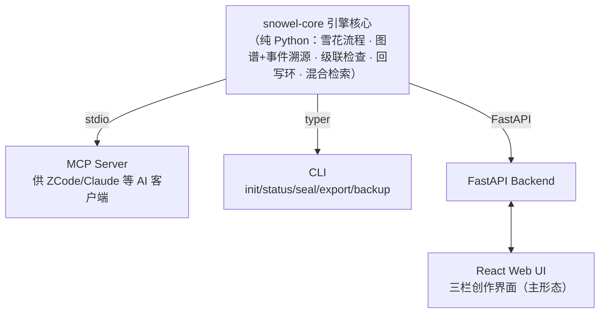

# Snowel —— AI 小说生成引擎

> 基于雪花写作法的 AI 辅助**超长篇**（百万字级）小说创作系统 · 本地单机 · 作者主导

---

## 命名

**Snowel** 源自 **Snowflake**（雪花写作法）+ **Novel**（小说）。

同时是六层渐进式创作架构的首字母组合：

| 层级 | 提供字母 | 阶段名称 | 雪花隐喻 |
|:---|:---:|:---|:---|
| 灵感雪核 | **S** | **S**ingle Sentence Premise | 云端雪核，一切的开始 |
| 故事骨架 | **n** | Expansio**n** | 初绽之花，骨脉为枝 |
| 角色血肉 | **o** | **O**riginal Character | 盛放之花，魂息为瓣 |
| 场景脉络 | **w** | Scene Flo**w** | 繁锦之花，幕影为纹 |
| 正文绽放 | **e** | Sc**e**ne Writing | 华彩之花，文字为晶 |
| 记忆守护 | **l** | Sea**l** | 下雪了！！！ |

---

## 简介

Snowel 是一款本地单机的 AI 小说创作辅助工具，面向百万字级超长篇小说的创作全流程。核心命题：**雪花法是写作流程，不是数据模型**——"从粗到细的生成路径"与"长篇创作中的知识管理"分开设计、再咬合。

## 核心特性

- **分形雪花流程**：大雪花（全书 L1-5）→ 中雪花（卷级滚动展开）→ 小雪花（章级微节拍），300 章不在 Layer 4 一次排完
- **知识图谱正典**：本体 + 可插拔题材属性组，关系/机制/伏笔皆为一等节点；append-only 事件溯源，支持任意历史拍号的世界状态重放
- **提案-diff-确认范式**：AI 产出永远是提案，作者确认才落典；高敏感事实必须确认，低敏感 auto 入典可事后批量否决
- **级联一致性守护**：矛盾/依赖/叙事区间三类检查，封卷冻结线与显式 retcon，改一处提示全书影响
- **伏笔全生命周期**：独立横切实体，多层定位（beat→scene→chapter）自动层间换算，死亡角色检索自动附带状态
- **回写环**：正文文件为真相源，抽取入典、镜像对账、作者外部编辑自动检测
- **混合检索**：图谱精确拉取为主，FTS5 + 向量兜底，写前上下文组装全程审计

## 总体架构

一个项目 = 一个本地工作区目录（Markdown 章节文件 + `snowel.db` 知识图谱）；领域逻辑只在核心，三个外壳均为薄壳。

## 技术栈

| 层 | 选型 |
|---|---|
| 语言 | Python 3.12+ / TypeScript |
| 存储 | SQLite 单库（节点/边表 + FTS5 + sqlite-vec），事件溯源 + fold 检查点 |
| LLM | litellm（生成大模型 / 抽取小模型）；嵌入默认本地 bge 系 |
| MCP | 官方 `mcp` Python SDK |
| Web | FastAPI + React + Vite |

## 项目状态

**当前处于设计完成、实现未启动阶段**（v1.0.0）。

落地顺序：snowel-core（本体 + 事件溯源 + 基础查询）→ MCP/CLI 薄壳 → 回写环 + 混合检索 → Web 三栏界面。

## 文档

| 文档 | 位置 |
|---|---|
| 需求规格（定稿） | [docs/v1.0.0/requirements.md](docs/v1.0.0/requirements.md) |
| 设计规格（定稿：schema + 模块） | [docs/v1.0.0/design.md](docs/v1.0.0/design.md) |
| 测试用例（待写） | docs/v1.0.0/testcases.md |
| 迭代过程文档（模拟推演、三轮需求澄清、两轮设计裁决） | docs/v1.0.0/details/ |
| 实现计划（待拆） | docs/v1.0.0/plans/ |

## 许可证

Apache License 2.0
