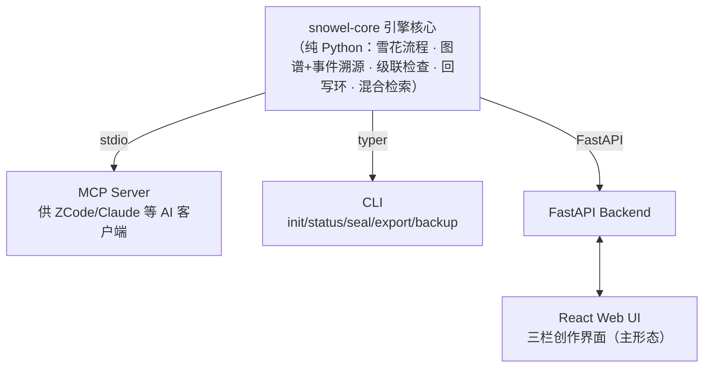

# Snowel —— AI 小说生成引擎

> 基于雪花写作法的 AI 辅助**超长篇**（百万字级）小说创作系统 · 本地单机 · 作者主导

---

## 命名

**Snowel** = **Snowflake**（雪花写作法）+ **Novel**（小说）。

六个字母恰好对应六级渐进式创作阶段：

| 字母 | 层级 | 阶段 |
|:---:|:---|:---|
| **S** | 灵感雪核 | **S**ingle Sentence Premise（一句话梗概） |
| **n** | 故事骨架 | Expansio**n**（摘要与一页纸大纲） |
| **o** | 角色血肉 | **O**riginal Character（角色档案与关系） |
| **w** | 场景脉络 | Scene Flo**w**（场景卡与节拍） |
| **e** | 正文绽放 | Sc**e**ne Writing（正文生成） |
| **l** | 记忆守护 | Sea**l**（封卷与知识正典冻结） |

>  「下雪了。」

---

## 简介

Snowel 是一款本地单机的 AI 小说创作辅助工具，面向百万字级超长篇小说的创作全流程。核心命题：**雪花法是写作流程，不是数据模型**——"从粗到细的生成路径"与"长篇创作中的知识管理"分开设计、再咬合。

## 核心特性

- **分形雪花流程**：大雪花（全书 L1-5）→ 中雪花（卷级滚动展开）→ 小雪花（章级微节拍），300 章不在 Layer 4 一次排完
- **知识图谱正典**：本体 + 可插拔题材属性组，关系/机制/伏笔皆为一等节点；append-only 事件溯源，支持任意历史拍号的世界状态重放
- **提案-diff-确认范式**：AI 产出永远是提案，作者确认才落典；高敏感事实必须确认，低敏感 auto 入典可事后批量否决
- **级联一致性守护**：矛盾/依赖/叙事区间三类检查，封卷冻结线与显式 retcon，改一处提示全书影响
- **伏笔全生命周期**：独立横切实体，多层定位（beat→scene→chapter）自动层间换算，死亡角色检索自动附带状态
- **回写环**：正文文件为真相源，抽取入典、镜像对账、作者外部编辑自动检测
- **混合检索**：图谱精确拉取为主，FTS5 + 向量兜底，写前上下文组装全程审计

## 总体架构

一个项目 = 一个本地工作区目录（Markdown 章节文件 + `snowel.db` 知识图谱）；领域逻辑只在核心，三个外壳均为薄壳。

## 技术栈

| 层 | 选型 |
|---|---|
| 语言 | Python 3.12+ / TypeScript |
| 存储 | SQLite 单库（节点/边表 + FTS5 + sqlite-vec），事件溯源 + fold 检查点 |
| LLM | litellm（生成大模型 / 抽取小模型）；嵌入默认本地 bge 系 |
| MCP | 官方 `mcp` Python SDK |
| Web | FastAPI + React + Vite |

## 文档

所有设计文档在 [docs/](docs/) 下，按版本组织（如 `docs/v1.0.0/`）：

| 文件 | 用途 |
|---|---|
| `requirements.md` | 需求规格：产品定位、架构铁律、本体/流程/检索/三端交互需求及全部裁决 |
| `design.md` | 设计规格：本体 schema、事件溯源、模块划分、LLM 接口、扩展包与级联引擎 |
| `testcases.md` | 黑盒测试用例：验收基准，反向链接需求与裁决 |
| `plans/` | 实现计划：按子系统拆分的 TDD 执行计划 |
| `details/` | 迭代过程文档：模拟推演走查、各轮澄清的原始记录 |

## 许可证

Apache License 2.0
