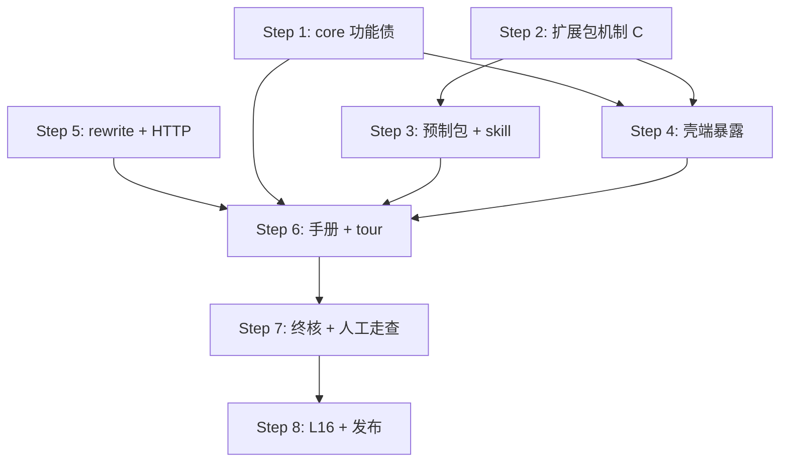

# 范围扩容执行交接文档（handoff-scope-extension-01）

> 写于 2026-08-26，范围扩容裁决落盘后。新会话从本文件 + AGENTS.md 阶段指针 + memory（snowel-v1-todo）恢复，按 8 step 链拆计划执行。
> **性质**：v1.0.0 最终冲刺——全部 v1.1 移后事项已移入 + 新增 Web 指引/手册，走 8 个实现计划（每 step 一计划，dev-workflow 全规约）。

## 1. 当前状态

| 项 | 值 |
|---|---|
| 分支 | dev-1.0.0 @ 7a28e45（已推送 origin） |
| 已完成 | 四步实现计划 + 验收补丁计划（a4dc7b5）；范围扩容需求定稿（7a28e45） |
| 测试基线 | 后端 264/264 + 前端 vitest 74/74 + `npm run build` 绿 |
| 需求基准 | `docs/v1.0.0/requirements-addendum.md`（13 裁决 + 8 step + 追溯表）——与 requirements.md 冲突处以增补为准 |
| 挂账 | 开放：L23（并入 Step 1）、L24（Step 2/3）、L25（Step 1/4）、L16（Step 8）；L26 = 记录性（chat 召回 20 有意上限，勿当 bug 报）；minor 池 ~20 项分摊各 step |
| 环境 | 主仓库 editable 已指向 `D:\Code\snowel`；worktree 用后即删；web 首次 `npm install` |

## 2. 8 step 链（顺序与依赖）

各 step 需求细则见 addendum §2–§7；执行规约 dev-workflow（worktree + feat 分支 + ledger 两段制 + 两席评审 + 终审修复波 + 合并推送）。**Step 7 走查用户主刀；Step 8 建 PR 须用户发话。**

## 3. Step 1 开箱上下文（下一个会话的任务）

**内容**（addendum §2）：beat_deleted（严格拒绝语义，TC-ON-17）+ L23 全家（merge 两端 active 校验、valid_until_beat 随 merge 迁移、重复合并在 active 校验下自然拒绝）+ TOCTOU（merge_beats 伏笔预查移入事务）+ derived_from 两阶段恢复（启动自愈，L6 reregister 同型幂等）+ derive_from 校验自动化测试 + core 侧 minor（inspirations ORDER BY、save_inspiration 空文本校验、extract_many 异常类型并入消息、json.loads NULL 防御）。

**源码锚点**（验收补丁刚落的代码，熟悉度高）：
- `api.py` ~353 merge_beats（预查+载荷 R1 模式，beat_deleted 照此风格）；~114 ai_generate derive_from 透传；~203-217 confirm 的 derived_from_registered 两阶段挂点
- `storage/projector.py` HANDLERS：beat_merged handler ~147-160；recompute_story_order ~96-101（T1 修过 story_order NULL 语义）
- `consistency/foreshadow.py` register（planted_at 校验/origin 枚举）
- 测试就近：`tests/consistency/test_foreshadow.py`（T1 的 merge 测试）、`tests/flow/test_inspiration.py`（T2）

**拆计划前必读**：dev-workflow skill（计划切法/提交约定）+ addendum §2 + `plans/2026-08-26-acceptance-gap/ledger.md` §3 挂账明细（preflight 双查）。

**注意**：TC-ON-17 建议用例与 beat_deleted 载荷 `{beat_id, reason?}` 已在 addendum §2.1 定稿，拆计划时直接引用，勿重开裁决。

## 4. 新会话恢复入口

1. AGENTS.md（每会话必读）——阶段指针已指向 8 step 链。
2. memory `snowel-v1-todo`——同口径 + 三类教训清单。
3. `docs/v1.0.0/requirements-addendum.md`——需求基准（13 裁决追溯表）。
4. 各计划 `docs/v1.0.0/plans/<plan>/ledger.md`——Ruling 全录与挂账。
5. 本文档——执行链操作单。

## 5. 注意事项

- 主仓库 pytest 前确认 editable 指向（`python -c "import snowel_core; print(...)"` 应为 `D:\Code\snowel\src\...`；worktree 干过活后回来要重装 `pip install -e . -e ./shell`）。
- 黑盒用例口径：**9 域 75 例**（新增 TC-ON-17、TC-SH-09~14、TC-RT-07、TC-EX 转正随各 step 落地时同步进 `testcases.md` 并登记 `tests/README.md` 反向索引——终核教训：索引会虚登记，落锚时 grep 实证）。
- 扩展包方案 C 的两条默认细则（全局包升级不自动跟随；载荷上限=属性组+级联规则，生成偏好/文风/角色模板明确排除）是裁决的一部分，实现时不得越界。
- 每步收尾照 dev-workflow §7 全流程（终审→修复波→合并→全量重跑→归档→AGENTS.md 指针→推送）；跨 step 挂账编号从 L27 顺延。
