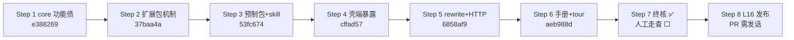

# v1.0.0 收尾工作交接（handoff-v1-final）

> 日期：2026-08-28。性质：8 step 范围扩容链 Step 1–6 全部完成、Step 7 覆盖终核已完成后的**工作交接**——剩余部分（人工走查、修复波、L16 发布）在新会话中规划和执行。
> 上游：`requirements-addendum.md` §7（收尾定义）；各 step ledger 见 `plans/` 目录（下表）。
> 本文档是 v1.0.0 收尾阶段的**唯一执行入口**：新会话从这里开箱。

## 1. 状态总览

| 项 | 值 |
|---|---|
| 分支 | dev-1.0.0 @ 8149dd5（已推送远端；L1–L25 全关、83 例黑盒全锚） |
| 测试基线 | 后端 pytest **331/331** + 前端 vitest **125/125** + `npm run build` 绿（合并后主仓库复跑口径，editable 双装） |
| 终核结论（2026-08-28） | **83 例全量核对通过**：testcases.md 实数 83；新用例 TC-ON-17、TC-EX-01–05、TC-RT-07、TC-SH-09–14 共 13 例逐一定位真实测试锚（pytest/vitest 文件实证）；§11.1/§11.2 矩阵联动一致；tests/README 反向索引详实。**走查前置条件满足** |
| 发话点 | ①人工走查启动（用户主刀）②Step 8 建 PR（dev-1.0.0 → main）③GitHub Release |

## 2. 六步交付摘要

| Step | 交付 | 合并 | ledger |
|---|---|---|---|
| 1 core 功能债 | beat_deleted 严格拒绝 + L23 全家 + TOCTOU + derived_from 两阶段恢复 | e388269 | `plans/2026-08-27-core-debt/` |
| 2 扩展包机制 | 方案 C 事件化挂载 + `snowel ext` 四命令 + 启动重载 + conftest fastapi 条件化；L24 关 | 37baa4a | `plans/2026-08-27-ext-pack/` |
| 3 预制包+skill | `extensions/infinite-flow/` 真包（四组 flow_*+示范规则）+ `extensions/SKILL.md` 双落；EX-①② 关 | 53fc674 | `plans/2026-08-28-infinite-flow/` |
| 4 壳端暴露 | Web 灵感面板+拍操作 + MCP advanced 四 op + generate derive_from；**L25 全关**；顺手修 scenes→scene 前置事实（见 §3.4） | cffad57 | `plans/2026-08-28-shell-exposure/` |
| 5 rewrite+HTTP | rewrite_query 默认开三入口统一+失败回落审计 + `snowel mcp --http` 保守分层 | 6858af9 | `plans/2026-08-28-rewrite-http/` |
| 6 手册+tour | 手册 12 章弹窗（react-markdown）+ tour 欢迎卡六步 + TC-SH-13/14 | aeb988d | `plans/2026-08-28-manual-tour/` |

## 3. 人工走查（Step 7 剩余部分，用户主刀）

> 形态：真浏览器黑盒走查（助手可陪跑记清单）。发现项逐条记入走查清单 → 新会话按 dev-workflow 开修复波计划 → 合并推送 → 回归走查发现项。

### 3.1 既有清单全项（handoff-acceptance-01 §2.3 转录）

1. 暗色整体一致性；对比度 WCAG（正文 ≥7:1、次要 ≥4.5:1）
2. 1280px 与 1920px 两种宽度布局
3. 骨架屏/空态/错误反馈
4. 中文输入法聊天（IME Enter 不误发）
5. SSE 流式体验（工具卡片渐进 + 打字机 + 中断）
6. 正文编辑（加载/未保存圆点/切章确认）
7. 封卷/否决二次确认

### 3.2 新增面走查（本链交付的功能）

| 面 | 走查点 |
|---|---|
| 灵感面板 | 保存原话 → 列表 → 勾选灵感 → 生成表单 derive_from 提交 → 确认后 FlowTree 进度（场景卡走 scene 修复后链路） |
| 拍操作 | 拍侧栏渲染、合并两段式（伏笔迁移预览"将迁移 N 个伏笔"）、删除被引用拍的拒绝红条文案、readonly 禁用 |
| 手册弹窗 | "？"打开、目录 12 章、关键词过滤命中/复原、GFM 表格与代码块排版（**重点：ch 08/ch 12 长表格**）、esc/遮罩关闭 |
| tour | 首开欢迎卡**不遮工作区**的观感、六步气泡在真实视口的定位（jsdom 盲区）、前进/后退/退出、跳过后不再自动出现、手册"重看操作导览"重启 |
| 扩展包 CLI | `snowel ext list/mount/unmount/status` 走查（预制包挂载→写数据→卸载拦截→re-mount 升级语义） |
| MCP advanced | 真实 AI 客户端连 `snowel mcp`（stdio）与 `snowel mcp --http --token`（401/枚举）各过一遍 |
| 手册内容准确性 | 手册 20+ 处操作指令虽经两轮评审对照实现，走查时按"照做"口径再验一遍（尤其第 1 章快速上手全流程可从零走通） |

### 3.3 走查候选池（ledger ride 项中真浏览器可裁决的）

- **MT-①**：手册过滤词关闭后残留——重开见残缺目录是否碍眼（修法一行：open 时清空）
- **MT-②**：tour 气泡在长文案下的视口定位（魔数 200 + BUBBLE_WIDTH 双源——顺手导出常量）
- **MT-③**：欢迎卡与手册弹窗叠放观感（层序 z-40<z-50，被覆盖非浮于上）
- T4-①：labels.ts:35 注释过时（generate.py→flow/registry.py）——顺手一行
- T1 复审：`rewrite_failed` 字面简称 vs 实际 `{"failed": true}` 载荷——addendum 或用例行括注

### 3.4 已知行为说明（走查时勿误报）

- chat 召回 hybrid 默认 20 是**有意上限**（L26，勿当 bug）
- 检索默认开 rewrite：无 LLM key 时每次检索白付一次快速失败并落 rewrite_failed 审计行——**规格内行为**（无 key 用户建议按手册 12 章关闭）
- 默认 embedding 为 deterministic（无语义召回），换说法未必命中——手册 12 章已注明，需真语义配 fastembed
- `snowel mcp --http` 绑通配地址强制 `--token`、错 token 401——守卫语义非缺陷

## 4. Step 8 发布债（L16 + 发版，走查修复波全清后）

| # | 事项 | 说明 |
|---|---|---|
| 1 | Windows python.org CPython 扩展加载崩 | jieba/sqlite-vec 族验证与规避（锁 wheel 版本或纯 Python 回退）——需 Windows 真机/python.org 构建 |
| 2 | **mcp 依赖下限提版**（RW-①） | `shell/pyproject.toml` `mcp>=1.2,<2` → `>=1.29`（新 SDK 面在 1.2 不存在，装旧版连 stdio 一起崩） |
| 3 | GitHub Release 打包流程 | tag → CI/脚本产出 zip（源码 + `web/dist` 构建产物 + 一键启动脚本 + README 安装节）；两包结构维持（`pip install -e . -e ./shell`） |
| 4 | 发布顺序 | 走查修复波全清 → tag v1.0.0 → Release → dev → main PR（**建 PR 须用户发话**）→ main 打 tag |

## 5. 跨计划遗留（全部非阻塞）

| 挂账 | 状态 |
|---|---|
| L16（上表 1/2） | 开放，Step 8 |
| L26 chat 召回 20 有意上限 | 记录性，勿当 bug |
| L27 pydantic_settings 'lifespan' 警告 | 卫生项，专门时机（第三方库内部路径） |
| EX-③ 警告池归因漂移 | 挂账条件"任何壳扩展包面落地之日"——当前 Web/MCP 无扩展面 |
| MT/T 系 ride 小项 | 见各 ledger 挂账表，走查候选池之外的均为低价值 polish |

## 6. 新会话工作方式

- **走查发现项**：记入清单（一句话+复现路径）→ 全部收集后按 dev-workflow 开修复波计划（多数预期为一行级）→ 合并推送 → 用户回归确认。
- **Step 8 启动**：走查全清后用户发话 → 开 L16 发布计划（上表 4 项）→ tag/Release/PR 均需用户逐项发话。
- 测试基线守护：任何收尾改动后 `pytest + vitest + npm run build` 三绿才合并（editable 双装：`pip install -e . -e ./shell` + `web` 下 `npm ci`）。
