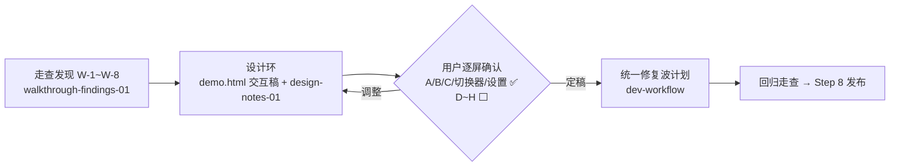

# Web 重构设计环工作交接（handoff-web-redesign-01）

> 日期：2026-08-29。性质：Step 7 人工走查**中途转入 Web 重构设计环**后的工作交接——设计稿已完成待用户确认，定稿后统一修复。
> 上游：`walkthrough-findings-01.md`（W-1~W-8 发现清单）、`web-redesign/design-notes-01.md`（设计说明与裁决）、`sim-walkthrough-01.md`（方法论上游）。
> 本文档是 **Web 重构设计环的唯一执行入口**：新会话从这里开箱。v1.0.0 总入口仍是 `handoff-v1-final.md`（Step 8 发布债不变）。

## 1. 状态总览

| 项 | 值 |
|---|---|
| 分支 | dev-1.0.0（本轮工作已提交，见 §4 提交链） |
| 走查状态 | **暂停**——W-1~W-4 已复现实证落盘；handoff-v1-final §3 余项（IME/SSE/手册"照做"/ext CLI/MCP）待修复波后回归时一并走 |
| 设计稿 | `web-redesign/demo.html`（**交互式**，可真实操作：向导/切层/裁决/切书/设置/伏笔地图；纯前端状态机，刷新重置） |
| 设计确认进度 | 屏 A 四步向导、B/C 层工作台、项目切换器、⚙ 设置弹窗 **形态已确认**（三项裁决 Q1~Q3 + R-1/R-2 补充需求）；**屏 D~H（节拍表/角色/场景/正文/伏笔地图）待用户过目** |
| 铁律 | **设计稿定稿前不改实现代码**（用户明令；W-1~W-8 全部纳入定稿后的统一修复波） |

## 2. 本轮已完成

| # | 事项 | 凭证 |
|---|---|---|
| 1 | **L16 扩展加载崩验证证伪关闭**（python.org 3.12.8 全链路实证，零代码改动；Step 8 剩 RW-① + Release 打包） | baa7458 + `details/l16-windows-verification.md` |
| 2 | 走查部署（项目 `D:\Code\snowel-walkthrough` + `snowel web` 8642） | 本文档 §5 |
| 3 | 走查发现 W-1~W-8 复现与落盘（tour 定位系统性错误/正文无框/死按钮/500 裸告/矮窗口/方法论不可见/LLM 配置缺失/JSON 裸露） | 9ef8f33 + `walkthrough-findings-01.md` |
| 4 | 三项设计裁决 + 用户补充需求 R-1（书架建书）/R-2（多项目切换，C4 需扩展）落盘 | c5385ea |
| 5 | demo-01/02/03 静态稿 → **合并为交互式 demo.html**（自测中修掉 4 个前端 bug：inline handler 作用域/空项目渲染崩/引号嵌套/savedot 抹除） | 08eaf20 |

## 3. 设计裁决（已定，勿反复）

| # | 裁决 |
|---|---|
| Q1 | 中栏 = **层工作台动态中栏**（随层切换内容，L5 才是正文编辑器） |
| Q2 | LLM 配置存**项目级**（config 表扩 `llm.api_key`/`llm.base_url`）+ 顶栏右上角 ⚙ 常驻设置入口 |
| Q3 | 设定缺口轨道 **本期落地**（core `setting_gap_report` 全套，sim #7） |
| R-1 | Web 首开向导含**创建项目/命名**（sim 第 0 步补位） |
| R-2 | **单 server 多项目**：`GET/POST /api/projects` + 切换路由；C4"每进程一项目"需正式扩展（TC-SH-06 测试锚修订）；默认方案：Web 建的书落 `~/.snowel/projects/<书名>/`，CLI 书走导入 |
| D1~D4 | 层推进软引导不硬锁 / locate 删除+extra 自然语言化 / 合并稿确认走扩展面 / tour 重写为进度塔自解释（旧 tour 去留待定） |

## 4. 下一步流程（新会话按序执行）

1. **用户过 demo.html**（重点 D~H：节拍表逐拍粒度、正文层 CONTEXT 卡信息量、伏笔地图形态）→ 反馈逐条记入 `walkthrough-findings-01.md` 或直接改 demo。
2. **设计定稿**：D~H 确认后，design-notes-01.md §5 屏清单全部 ✅，宣布定稿。
3. **按 dev-workflow 开统一修复波计划**，范围基线（design-notes §5 末段）：
   - W-1~W-5 修复项（tour 重写/正文空态骨架/去生成联动/500 错误映射/响应式）
   - **11 块后端缺口**：① llm-config 三端点 ② projects 三端点（多项目，C4 扩展）③ session 层待办扩展 ④ 提案合并稿/编辑稿确认扩展 ⑤ setting_gap 全套（Q3）⑥ compose_context 预览端点 ⑦ 伏笔时间线/清单查询面 ⑧ 关系节点查询面 ⑨ 角色 completeness 状态面 ⑩ 场景卡结构化查询 + 多轨统计 ⑪ "AI 忘了 X"回写端点
   - 计划拆分建议：后端面（core→壳）与前端重构分波，多项目重构（R-2）单独任务；三绿守护（pytest+vitest+build）不豁免
4. 修复波合并推送后 → **回归走查**（W 项回归 + handoff-v1-final §3 余项）→ Step 8 发布（RW-① + Release 打包，均需发话）。

## 5. 本机环境与服务

| 项 | 值 |
|---|---|
| 走查主服务 | `snowel web -p "D:\Code\snowel-walkthrough" --host 127.0.0.1 --port 8642`（后台任务随会话终止，重启用此命令） |
| 设计稿服务 | `python -m http.server 8899 --directory "D:\Code\snowel\docs\v1.0.0\details\web-redesign" --bind 127.0.0.1` → http://127.0.0.1:8899/demo.html |
| 遗留说明 | 用户已退出 Clash（verge-mihomo 断网重连后连接池泄漏曾耗尽系统套接字缓冲区，bind 全报 10055——若复现，等内核回收或重启代理；非 Snowel 问题） |
| 走查项目 | `D:\Code\snowel-walkthrough`（部分被走查弄脏：无提案数据，仅 tour/localStorage 态；回归前可删库重建） |

## 6. 教训（本轮新增）

- **复现视口纪律**：web 问题默认标准视口 + DOM 数值证据，勿对齐用户偶发窗口几何（`memory/reproduction-viewport-discipline.md`）。
- **交互式 demo 是需求确认的最高带宽介质**：静态稿三轮才对齐的信息量，可操作 demo 一轮就能让用户发现"项目创建缺失"这类结构性遗漏（R-1 即用户玩 demo-02 前身时提出）。
- **纯前端状态机 demo 也要防真 bug**：inline handler 作用域、空态渲染防御、引号嵌套——写完立刻 `node --check` + 浏览器全链路自测，别交给用户当第一个测试员。
