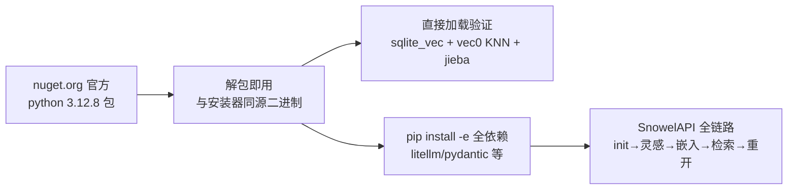

# L16 验证记录：Windows python.org 构建扩展加载（2026-08-29）

> 性质：Step 8 发布债 L16 第 1 项（"Windows python.org CPython 扩展加载崩——jieba/sqlite-vec 族验证与规避，需 Windows 真机/python.org 构建"）的**实证验证记录**。结论：**崩前提证伪，无需规避代码**；L16 剩余内容收敛为 RW-①（mcp 下限提版）+ Release 打包流程。

## 1. 结论

| 项 | 结果 |
|---|---|
| 原始诊断 | "Windows python.org 构建 sqlite3 无 `enable_load_extension` → `api.open` 崩"（`plans/2026-08-24-writeback-retrieval-flow/ledger.md` L16） |
| 实证结果 | **证伪**：python.org 官方 Windows 构建的 `sqlite3.dll` 自带扩展加载支持；jieba / sqlite-vec / vec0 虚表 / `SnowelAPI` 全链路全部通过 |
| 处置 | **关闭 L16 第 1 项，零代码改动**（不为不存在于目标平台的场景写防御性代码；规避方向"锁 wheel 版本/纯 Python 回退"失去前提，不实施） |
| 原误诊来源（推断） | macOS 系统 Python 与多数 Linux 发行版 Python 确实缺 `enable_load_extension`（知名坑），被误记到 Windows python.org 构建头上 |

## 2. 验证环境与方法

- **Windows 真机**：win32 10.0.26200 x64（即本机）。
- **python.org 构建**：nuget 官方包 `python 3.12.8`（`nuget.org/api/v2/package/python/3.12.8`）——CPython 官方发布管线的同源二进制，免安装解包即用，满足 handoff"需 Windows 真机/python.org 构建"的验证条件。
- **依赖版本**：与开发环境逐项同版——sqlite-vec 0.1.9、jieba 0.42.1、sqlite 库 3.45.3（与 miniconda 侧一致，可对照）。

## 3. 验证结果明细

| # | 验证点 | 命令/路径 | 结果 |
|---|---|---|---|
| 1 | `enable_load_extension` 存在性 | `hasattr(sqlite3.Connection, "enable_load_extension")` | **True**（sqlite 库 3.45.3） |
| 2 | sqlite_vec 扩展加载 | `sqlite_vec.load(conn)` + `SELECT vec_version()` | OK（v0.1.9） |
| 3 | vec0 虚表 + KNN | 建表 → 插入 → `MATCH ... AND k=1` | OK（distance 0.0） |
| 4 | jieba 分词 | `jieba.cut` | OK（0.42.1） |
| 5 | `SnowelAPI.init_project` | `vec.ensure` + 扩展包启动重载 | OK |
| 6 | 灵感层 + 嵌入重建 | `save_inspiration` + `rebuild_embeddings`（deterministic） | OK |
| 7 | 混合检索 | `search`（FTS+jieba+vec；无 key rewrite 快速失败为规格内） | OK |
| 8 | 重开路径 | `SnowelAPI.open`（migrate + vec.ensure 已建表短路）+ 二次检索 | OK |
| 9 | wheel 版本悬崖（发布视角） | `pip download --python-version 313/314 --only-binary` | OK——sqlite-vec wheel 为 `py3-none-win_amd64`（版本无关标签），3.13/3.14 不缺 wheel |

## 4. 对 Step 8 的影响

| L16 原子项 | 新状态 |
|---|---|
| 1. Windows python.org CPython 扩展加载崩 | **关闭**（本文档，2026-08-29） |
| 2. mcp 依赖下限提版（RW-①：`>=1.2` → `>=1.29`） | 开放，Step 8 |
| 3. GitHub Release 打包流程（tag → zip → README 安装节） | 开放，Step 8 |
| 4. 发布顺序（修复波全清 → tag/Release/PR，逐项发话） | 开放，Step 8 |
