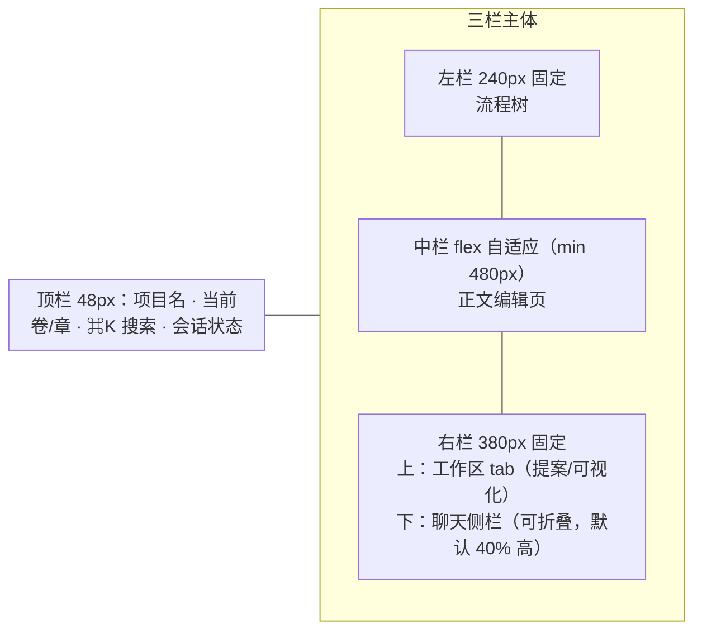

# UI 设计规约（web-ui 计划配套，ui-design-01）

> 状态：定稿（2026-08-25，三裁决经用户确认：暗色创作舱 / 单主题 / Tailwind）。
> 效力：`docs/v1.0.0/plans/2026-08-25-web-ui/plan.md` 全部前端任务（T9–T13）的实现约束与验收标准（W9 裁决）。
> 上游：需求 §7.1（三栏布局 + 常驻聊天侧栏 + 确认落结构化面板）。

## 1. 风格定位

**暗色创作舱**：深灰蓝底、暖白正文、琥珀强调。为夜间长时间写作设计——正文编辑区视觉地位最高，其余面板（流程树/工作区/聊天）退居背景。参照气质：Obsidian / iA Writer dark。v1 单主题，不做明暗切换。

## 2. 设计 tokens（Tailwind 主题映射的唯一来源）

### 2.1 色板

| Token | 值 | 用途 |
|---|---|---|
| `bg-base` | `#16181D` | 页面底色 |
| `bg-panel` | `#1E2128` | 三栏面板、顶栏 |
| `bg-raised` | `#262A33` | 卡片、输入框、代码块、hover 态 |
| `border` | `#333845` | 细边框（1px）、分隔线 |
| `text-primary` | `#D6D9DE` | 界面主文字 |
| `text-prose` | `#E8E4DC` | 正文编辑区暖白（与 UI 文字区分，强化"正文为王"） |
| `text-muted` | `#8B909C` | 次要文字、占位符、时间戳 |
| `accent` | `#E2A03F` | 琥珀强调：主按钮、选中态、current_layer 高亮、聊天用户气泡 |
| `danger` | `#E05252` | major 冲突、否决、危险操作、diff 旧值 |
| `ok` | `#5BB98B` | 确认成功、done 层、diff 新值 |
| `warn` | `#E5B93F` | stale 提案、只读横幅、外部改动警告 |

约定：danger/ok/warn 用于语义色时**必配图标或文字标签**（色盲可达）；对比度以 WCAG AA 校验为准（正文 ≥7:1、次要 ≥4.5:1），执行期用工具核对，不达标调 token 不调组件。

### 2.2 字体与排版

| Token | 值 | 用途 |
|---|---|---|
| `font-ui` | `system-ui, "Segoe UI", "Microsoft YaHei", "PingFang SC", sans-serif` | 界面 UI |
| `font-prose` | `Georgia, "Noto Serif SC", "Songti SC", serif` | 正文编辑区（衬线，写作感） |
| `font-mono` | `ui-monospace, Consolas, monospace` | diff 值、节点 id、代码 |
| 尺度 | UI 14px 基准（12/14/16/18/22）；正文 16px；行距 UI 1.5 / 正文 1.9 | |
| 正文行宽 | `max-width: 42em` 居中 | 长文阅读友好 |

### 2.3 间距 / 圆角 / 动效

| 类别 | Token |
|---|---|
| 间距 | 4 / 8 / 12 / 16 / 24 / 32（Tailwind 默认刻度） |
| 圆角 | 面板 10px、卡片与输入 8px、按钮与 chip 6px |
| 边框 | 全局 1px `border` 色；选中态 1px `accent` |
| 动效 | hover/过渡 150ms ease-out；面板展开/收起 200ms；reply 打字机 20ms/字；骨架屏 shimmer 1.2s 循环 |

## 3. 布局规约

- 顶栏：左"● snowel + 项目名"；中"卷二 · 第 12 章"（当前编辑位置）；右 ⌘K 搜索入口 + 会话状态点（绿=写会话 / 黄=只读）。
- 左栏：七层流程（done ✓ accent 勾 / todo ○ muted / current ● warn 高亮行）+ 卷→章两级树（当前编辑章 accent 左边条）；底部折叠的"已封卷"徽标区。
- 右栏上下分区：工作区 tab（提案 / 可视化）在上，聊天侧栏在下（可收起为输入条，展开默认占右栏高 40%）。
- 只读模式：顶栏下常驻 warn 黄条"只读模式：写租约由 {holder} 持有"，一切写按钮 disabled + 409 错误统一红条。

## 4. 组件样式基准

| 组件 | 规约 |
|---|---|
| 主按钮 | `accent` 底 + `bg-base` 字，hover 提亮 8%；用于"确认提案""生成" |
| 次按钮 | `bg-raised` 底 + `text-primary` 字 + 1px border；用于"否决""取消" |
| 危险按钮 | `danger` 描边幽灵样式；**封卷、retcon 确认、否决**点击后弹二次确认对话框（§5） |
| 面板卡片 | `bg-panel` 底 + 8px 圆角 + 1px border；卡片内标题 14px + muted 辅助行 |
| chip/徽章 | 6px 圆角 12px 字：major=`danger`、minor=`warn`、done=`ok`、stale=`warn` 描边、pending=`text-muted` |
| diff 对照表 | 旧值：`font-mono` + `danger` 底色 20% 透明 + 删除线；新值：`ok` 底色 20% 透明；同行键名 `text-muted` |
| 输入框 | `bg-raised` + 1px border，聚焦 1px `accent`；占位符 `text-muted` |
| 骨架屏 | `bg-raised` 圆角块 + shimmer 动效，用于流程树/提案列表/统计图加载态 |

## 5. 交互易用性规约（重点）

1. **加载态**：任何 >300ms 的请求对应区域显示骨架屏（非白屏）；按钮请求中 spinner + 禁用。
2. **空态引导**：新项目首次打开——左栏 current_layer 行展开提示"从这一层开始：在聊天里说出你的想法，或点右侧'生成'"；空提案列表显示"暂无待确认提案"占位卡；无章正文中栏显示"还没有章节——生成第一个场景提案"。
3. **错误反馈**：后端 `detail` 文案直显红条 + 关闭钮；网络失败红条带"重试"按钮；流式聊天的 error 事件红条入对话流。
4. **危险操作二次确认**：封卷（文案"封卷后卷内设定改动须走显式 retcon"）、retcon 确认（展示 impact 摘要 + 受影响提案数）、否决提案——均弹确认对话框，Esc/取消可退出，confirm 键盘焦点默认在"取消"。
5. **diff 面板可读性**：节点-键-旧→新三列表格；major 冲突行左侧 2px `danger` 边条并置顶；minor 用 `warn`；同提案多键冲突全部展示（L19 全量展开）。
6. **stale 提案**：列表与面板双处 `warn` 描边 + stale_hint 以 tooltip/辅助行展示。
7. **快捷键**：聊天 Enter 发送 / Shift+Enter 换行；`⌘K`（Ctrl+K）聚焦搜索；Esc 关闭对话框/中断聊天流。
8. **聊天流式体验**：tool_call 卡片（"调用 generate…"）到达即渲染 + spinner，tool_result 就地更新成败；reply 打字机 20ms/字；流进行中显示"中断"按钮（abort）；done 后 proposal_ids>0 → 底部 accent 链接"已入队 N 个提案 → 去确认"。
9. **正文编辑器**：`font-prose` + `text-prose` + 42em 行宽居中；未保存改动 = 顶栏当前章名旁 warn 圆点；外部改动（reconcile changed 非空）= 编辑器顶部 warn 条列出变更文件 + "重新登记"入口。
10. **键盘可达**：全部交互元素 Tab 可达、焦点环（1px `accent` outline）可见；对话框焦点陷阱。

## 6. 实现映射（Tailwind）

- `web/tailwind.config.ts`：§2 全部 token 映射为 `colors`（`bg-base/bg-panel/...` 语义名）、`fontFamily`（`ui/prose/mono`）、`borderRadius`、`boxShadow`（面板 elevation 两档）。
- 组件内一律使用语义 token 类名（如 `bg-panel text-primary`），**禁止裸十六进制色值**出现于组件代码——换 token 即换肤的唯一通道。
- 本文档与 tokens 演进：改风格先改本文档，再改 `tailwind.config.ts`，组件不动。

## 7. 验收锚（进计划各前端任务的测试/走查清单）

| 规约节 | 锚 |
|---|---|
| §2 色板/字体 | `web/tailwind.config.test.ts`：断言语义 token 值存在（防漂移） |
| §3 布局 | T9 App 壳测试：四容器 testid + 顶栏会话状态 |
| §4 diff 着色 | T10 ProposalPanel 测试：旧/新值类名断言 |
| §5.2 空态 | T9/T10/T11 组件测试：空数据占位文案 |
| §5.4 危险确认 | T10 测试：seal/否决点击弹确认框 |
| §5.7 快捷键 | T12 测试：Enter 发送不换行 |
| §5.8 打字机 | T12 测试：reply 最终文本渲染（不测帧） |
| 其余（骨架屏/焦点环/对比度） | 收尾人工走查清单（T14 后） |
