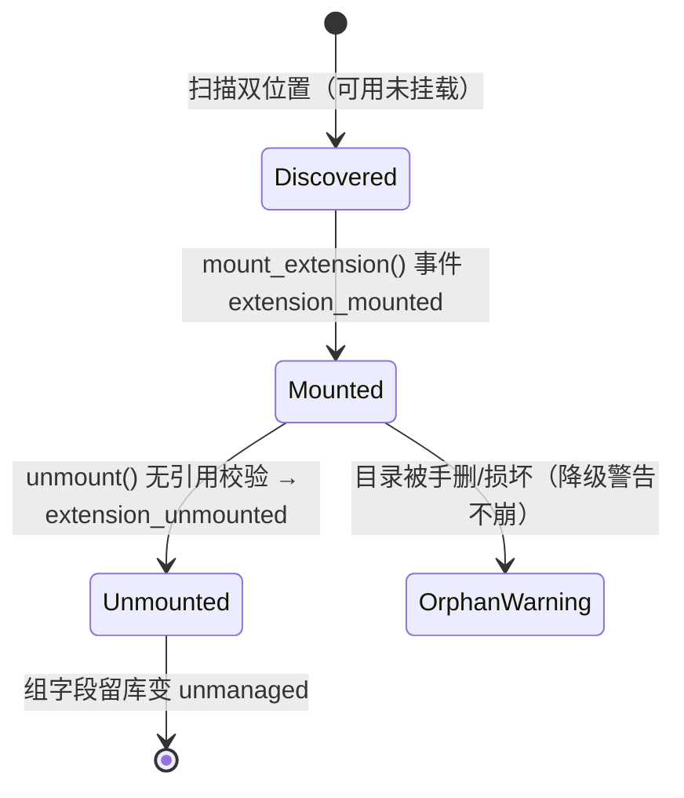
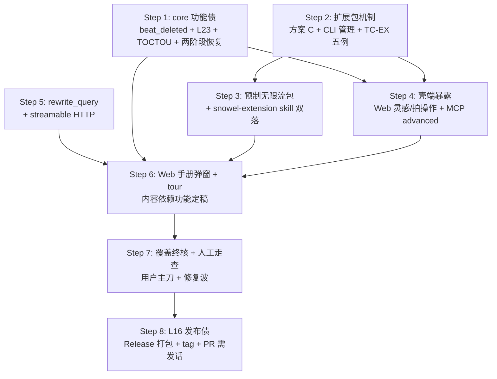

# v1.0.0 范围增补需求（requirements-addendum）

> 日期：2026-08-26。来源：验收补丁计划合入（a4dc7b5）后，用户裁决范围扩容——v1.1 移后事项**全部移入 v1.0.0**，并新增 Web 操作指引与使用手册需求。
> 上游：`testcases.md`（75 例口径）、`plans/2026-08-26-acceptance-gap/ledger.md`（L23–L26 挂账）、`details/sim-walkthrough-01.md`（无限流题材素材）。
> 性质：本文档是 v1.0.0 最终范围的需求定稿；与 requirements.md 冲突处以本文档为准（仅限本文档明列的条目）。

## 1. 范围总表

| 类 | 内容 | 来源挂账/裁决 |
|---|---|---|
| 移入·core 功能债 | beat_deleted + L23 全家（merge 两端 active 校验、valid_until_beat 迁移、重复合并语义）+ TOCTOU 事务内预查 + derived_from 两阶段恢复 | L23/L25，裁决 3 |
| 移入·扩展包 | 扩展包机制（方案 C 事件化挂载）+ TC-EX 五例转正 + 预制无限流薄包 + 制作规范 skill 双落 | L24，裁决 10/11、方案 C |
| 移入·壳端暴露 | 灵感层 + 拍合并/删除进 Web + MCP | L25，裁决 6 |
| 移入·可选口 | rewrite_query 检索改写（默认开 + 失败回落）；MCP streamable HTTP（保守分层） | §11.3 豁免转正，裁决 5/9 |
| 移入·minor 池 | 约 20 项 polish 全清（按域分摊进各 step 顺手修，不单开计划） | 补丁 ledger §3 |
| 移入·发布债 | L16：Windows python.org 扩展加载验证/规避 + GitHub Release 打包流程 | L16，裁决 4 |
| 新增·Web | 操作指引 tour + 使用手册弹窗（两个功能） | 裁决 2/7/8 |
| 排除 | 永久非目标（多用户/云同步/移动端/发布排版）继续不做；生成偏好不进包（薄包边界） | §1.2 / 裁决 11 修订 |

## 2. core 功能债（Step 1）

### 2.1 beat_deleted（TC-ON-17 建议）

- 语义（裁决 3，严格拒绝）：`api.delete_beat(beat_id)`——拍被任一伏笔 `planted_at` 引用 → 拒绝并提示"该拍承载 N 个伏笔引用，先 merge_beats 到承接拍或迁移伏笔"；空拍（无引用）→ 追加 `beat_deleted` 事件，投影拍 active=0，水位线照常。
- 事件载荷：`{beat_id, reason?}`；迁移不适用（删除不迁移任何引用，被引用即拒绝）。
- L23 伴生项：`merge_beats` 两端 active 校验（合并已失效拍/合入已失效目标 → ValueError）；`valid_until_beat` 指向被合并拍时随 merge 迁移到目标拍；重复合并同一源拍在 active 校验下自然拒绝。
- **TC-ON-17 用例**：伏笔引用拍 N → delete_beat(N) 拒绝且事件日志无新事件；迁移伏笔后 delete_beat(N) 成功，恰一条 beat_deleted。

### 2.2 健壮性修复（L25 core 部分）

- TOCTOU：`merge_beats` 伏笔预查移入追加事件的同一事务。
- derived_from 两阶段恢复：confirm 与 derived_from_registered 之间崩溃的窗口——启动时检测"产物节点已物化但 DERIVED_FROM 边缺失且 payload 带 derive_from"的提案，补录边（L6 reregister_prose 同型自愈，幂等）。
- 伴生测试：derive_from 校验错误路径自动化（非 Inspiration id / 缺失 id）。

## 3. 扩展包机制（Step 2 + Step 3）

### 3.1 方案 C 细则（事件化挂载）

- **发现**：项目 `<project>/extensions/` 优先于全局 `~/.snowel/extensions/`，同名项目内覆盖（TC-EX-01）；schema.json 必选、hooks.py 可选。
- **挂载**：`extension_mounted` 事件载荷 `{name, version, source_path, schema_digest}`（薄事件，不带 schema 全文）→ 投影到扩展包状态表；属性组注册入进程态注册表（`groups.register`），hooks 规则注册入 `engine.register`。
- **卸载**（TC-EX-03）：`unmount_extension` 事务前校验——属性组被活跃节点引用 → 拒绝（列出引用节点）；通过 → `extension_unmounted` 事件，数据保留（组字段降级 unmanaged）。
- **中途挂载**（TC-EX-02）：挂载前已写入的组字段保持 unmanaged 语义零回溯；已有节点不受影响。
- **错误隔离**（TC-EX-05）：schema.json 缺失 → 跳过该包并警告；hooks.py import/语法错误 → 隔离（丢该包规则、警告），核心照常启动。
- **升级语义**（C-1 细则）：全局包升级后已挂载项目**不自动跟随**（事件记版本+哈希），升级须显式 re-mount；目录被手动删除 → 启动警告 + 组降级 unmanaged，不崩。
- **管理入口（裁决 6）**：仅 CLI——`snowel ext list / mount <name> / unmount <name> / status`。
- **载荷上限**：属性组 + 级联规则两类；生成偏好、文风、角色模板**明确排除**（裁决 11 修订）。

### 3.2 预制无限流扩展包（Step 3，薄包）

- 位置：仓库 `extensions/infinite-flow/`（既是示范包也是测试素材）。
- schema.json：四属性组——空间资历 / 排名轨迹 / 能力清单 / 盲区特权（字段细则从 sim-walkthrough §人物模板 派生，拆计划时定）。
- hooks.py：一条示范级联规则（题材检查，如"排名轨迹组写入须附轨迹方向说明"，具体规则拆计划时定）。
- 包内 README：结构说明 + 指向制作规范 skill。
- 测试复用：TC-EX-01–05 的 fixture 优先用本包（另造最小 fixture 覆盖畸形包路径）。

### 3.3 制作规范 skill（Step 3，双落）

- 全局：`~/.agents/skills/snowel-extension/SKILL.md`（教 AI 会话辅助作者制作扩展包：目录结构、schema 规范、hooks API、挂载/校验/测试流程、发布为项目目录或全局目录）。
- 代码库：`extensions/SKILL.md` 同步副本（随 repo 分发，clone 即得）。
- 根 `README.md` 注明指针（一行）。
- 维护约定：以代码库副本为源，全局副本由 skill 自身说明同步方式（或软链）；拆计划时定同步机制。

## 4. 壳端暴露（Step 4）

| 功能 | Web | MCP advanced |
|---|---|---|
| 灵感层 | 灵感面板：保存原话 / 列表 / 从灵感发起 derive 生成（生成表单选灵感） | `inspiration_save / inspiration_list`；`generate` 带 `derive_from` |
| 拍合并/删除 | 正文编辑页拍操作：合并到相邻拍（含伏笔迁移预览）/ 删除空拍（被引用时呈现拒绝原因） | `beat_merge / beat_delete` |
| 扩展包 | —（不做 Web 面，裁决 6） | —（不做 MCP 面） |

建议用例：TC-SH-09（Web 灵感面板闭环）、TC-SH-10（Web 拍操作含拒绝呈现）、TC-SH-11（MCP advanced 新操作目录项）。

## 5. 检索改写与传输扩容（Step 5）

### 5.1 rewrite_query（TC-RT-07 建议）

- 默认**开**（裁决 9）：config `retrieval.rewrite` 默认 true；所有查询入口（api.search、compose_context 兜底召回、聊天检索）统一前置改写层。
- 失败语义：改写 LLM 调用异常/超时 → 自动回落原始查询走确定性检索，`retrieval_audit` 记 `rewrite_failed` 标记。
- 测试注入确定性改写端（FakeBackend 同型）；断言：改写生效（检索词变化可见于审计）、失败回落（结果仍出 + 审计标记）、关闭开关 = 纯确定性路径。

### 5.2 streamable HTTP（TC-SH-12 建议）

- 保守分层（裁决 5）：MCP 默认 stdio 不变；`snowel mcp --http` 显式开启，默认绑 `127.0.0.1`（端口可配）；绑 `0.0.0.0` 时强制 `--token <bearer>` 否则拒绝启动；token 校验失败 401。
- 测试：stdio 回归不破；HTTP 模式工具枚举与 stdio 一致（TC-SH-01 同断言）；0.0.0.0 无 token 拒绝启动；错误 token 401。

## 6. Web 操作指引 + 使用手册（Step 6）

### 6.1 手册弹窗（裁决 7）

- 内容源：Markdown 随前端打包（`web/src/manual/*.md` import 进构建，进 dist、进 Release）。
- 形态：居中大窗 modal + 左侧目录树 + 顶部关键词过滤（纯客户端匹配）；esc/遮罩关闭；"？"入口常驻顶栏。
- 章节范围：全部功能域——快速上手、雪花五层流程、提案与确认、回写与镜像、封卷/retcon、聊天侧栏、可视化四件、租约与多端、灵感层、拍编辑、扩展包（依赖 Step 1–5 定稿后撰写）。

### 6.2 操作指引 tour（裁决 8）

- 触发：首次打开显**欢迎卡**（不遮工作区），"开始导览"手动启动；跳过/完成后 localStorage 记忆不再自动出现；手册弹窗内可随时重启 tour。
- 步骤（建议 5–6 步，拆计划时定稿）：三栏布局 → 流程树/生成表单 → 提案确认 → 正文编辑 → 聊天侧栏 → 保存与租约。
- 高亮定位 + 气泡提示；步骤可前进/后退/随时退出。

建议用例：TC-SH-13（手册弹窗目录/搜索/内容渲染）、TC-SH-14（tour 欢迎卡→启动→步骤推进→localStorage 记忆→重看入口）。

## 7. 发布债与收尾（Step 7–8）

### 7.1 真浏览器人工走查（Step 7，用户主刀）

handoff §2.3 清单全项 + 新增面（灵感面板、拍操作、手册、tour、扩展包 CLI 管理走查）；走查前先做一轮全量覆盖终核（新用例 TC-ON-17、TC-SH-09–14、TC-RT-07、TC-EX 转正全部有锚）。

### 7.2 L16 发布债（Step 8，裁决 4）

- Windows python.org CPython 扩展加载崩（jieba/sqlite-vec 族）验证与规避（锁 wheel 版本或纯 Python 回退）。
- GitHub Release 打包流程：tag → CI/脚本产出 zip（源码 + `web/dist` 构建产物 + 一键启动脚本 + README 安装节）；两包结构维持（用户 `pip install -e . -e ./shell`）。
- 发布顺序：走查修复波全清 → tag v1.0.0 → Release → dev → main PR（**建 PR 须用户发话**）→ main 打 tag。

## 8. Step 拆解（每 step 拆一个实现计划）

| Step | 内容 | minor 池分摊 | 黑盒新例 |
|---|---|---|---|
| 1 | §2 全部 | core 侧（inspirations 排序、空文本校验、extract_many 异常类型、json.loads 防御等） | TC-ON-17 |
| 2 | §3.1 扩展包机制 + CLI 管理 | conftest fastapi 面依赖条件化 | TC-EX-01–05 转正 |
| 3 | §3.2 预制包 + §3.3 skill 双落 + README 注明 | — | （并入 TC-EX 实包锚） |
| 4 | §4 壳端暴露 | — | TC-SH-09/10/11 |
| 5 | §5 rewrite + HTTP | reject_auto 注释纠错等 shell 侧 | TC-RT-07、TC-SH-12 |
| 6 | §6 手册 + tour | Viz.test 常量解耦等 web 侧 | TC-SH-13/14 |
| 7 | §7.1 终核 + 走查 + 修复波 | 走查发现项 | 全量覆盖核对 |
| 8 | §7.2 L16 + 发版 | — | — |

执行规约沿用 dev-workflow（每 step 一计划、worktree、ledger 两段制、两席评审、终审修复波、合并推送）；Step 7 走查与 Step 8 PR 需用户发话的点保持不变。

## 9. 裁决追溯表

| 疑点 | 裁决 | 章节 |
|---|---|---|
| 移入口径边界 | 字面全移（含 rewrite_query），永久非目标除外 | §1 |
| 指引形态 | tour + 手册弹窗两功能 | §6 |
| beat_deleted 语义 | 严格拒绝；空拍直接删 | §2.1 |
| 发包形态 | GitHub Release 分发，两包不变 | §7.2 |
| HTTP 暴露面 | 保守分层（stdio 默认/127.0.0.1/0.0.0.0 强制 token） | §5.2 |
| 暴露矩阵 | 创作进 Web+MCP，管理仅 CLI | §3.1/§4 |
| 手册内容源 | Markdown 随前端打包；居中大窗+目录+搜索 | §6.1 |
| tour 机制 | 欢迎卡+手动启动+localStorage+可重看 | §6.2 |
| rewrite 默认态 | 默认开+失败回落（审计 rewrite_failed） | §5.1 |
| skill 落点 | 全局 ~/.agents/skills/snowel-extension/ + extensions/SKILL.md + README 注明 | §3.3 |
| 预制包厚度 | 薄包（schema+hooks+README），生成偏好排除 | §3.2 |
| 总顺序 | 全部完成→走查→L16→PR | §8 |
| C-1 升级跟随 | 不自动跟随，显式 re-mount | §3.1 |
