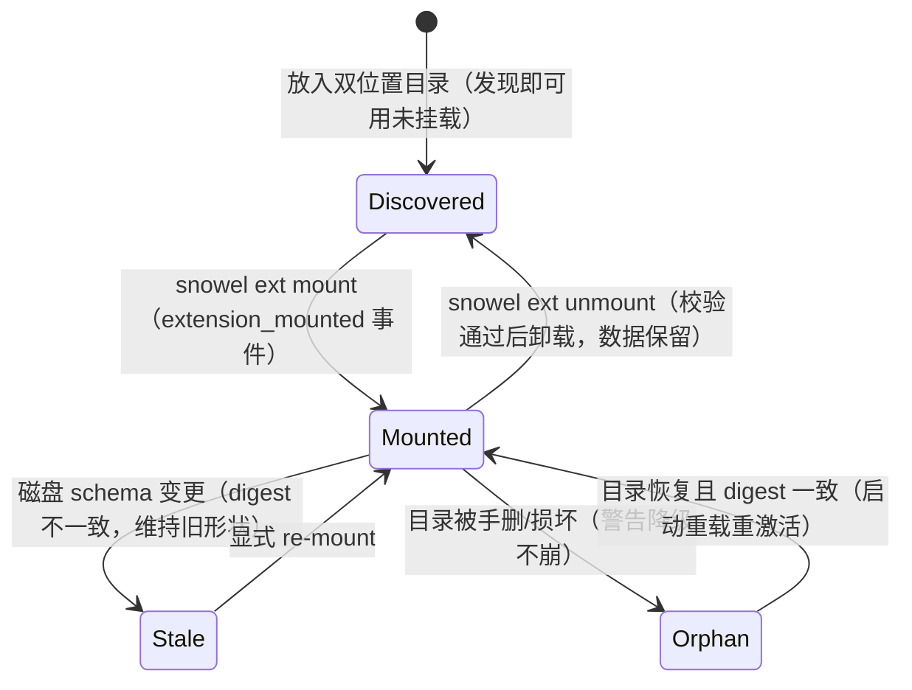

# Snowel Extension：扩展包制作规范

> **维护与同步**：本文件唯一源是 Snowel 代码库 `extensions/SKILL.md`；全局副本不做软链（Windows 下不可靠），改源后在**仓库根**执行同步命令复制：
>
> ```bash
> mkdir -p ~/.agents/skills/snowel-extension && cp extensions/SKILL.md ~/.agents/skills/snowel-extension/SKILL.md
> ```

## 1. 定位与载荷上限

- 扩展包（extension pack）= 一个给 Snowel 项目注入**题材数据结构与级联检查**的目录。可运行范例：仓库 `extensions/infinite-flow/`（无限流题材：四个属性组 + 一条示范规则），动笔前先通读它。
- 载荷只有两类：
  - **属性组**（attribute group，schema.json 声明，挂载后可写入节点 props）；
  - **级联规则**（cascade rule，hooks.py 注册，随级联一致性检查全库运行）。
- 生成偏好、文风、角色模板**明确排除**——没有机制承载，不要塞进包里。
- 安全红线：挂载即把 hooks.py 作为 Python 代码接入引擎进程。**只装可信来源的包**；替作者装第三方包前先人工读过 hooks.py。

## 2. 目录结构与双位置

```text
<项目>/extensions/<目录名>/      # 项目侧：随项目工作区走
~/.snowel/extensions/<目录名>/   # 全局侧：本机全部项目可用
  schema.json    # 必选：包清单 + 属性组定义（§3）
  hooks.py       # 可选：级联规则（§4）；无则纯 schema 包
  README.md      # 建议：包的用途、字段语义与示例
```

- 包的标识是 schema.json 的 `name` 字段（挂载/卸载命令用它）；目录名建议与之一致但机制上不要求。
- 发现顺序：先扫全局、再扫项目，**同名（name 相同）时项目侧覆盖全局侧**——想试验改包就复制一份到项目侧改，不影响全局原件。
- 全局目录不存在属正常（静默视为空）；放好包无需任何注册——任意打开项目的命令（`snowel status` / `snowel web` / `snowel ext list` 等）在打开项目时经启动重载（api open/init 尾部 → mounting.reload）自动发现并生效。
- 扩展是纯增量：`snowel init` 不预置、不定任何题材包；既有项目中途装/卸包对已有数据零惩罚（§5）。

## 3. schema.json 规范

- 外壳是标准 JSON Schema（JSON Schema，草案 2020-12 校验）的极简应用（下例为真包 `flow_rank_track` 组的节选示意）：

```json
{
  "name": "infinite-flow",
  "version": "1.0.0",
  "groups": {
    "flow_rank_track": {
      "type": "object",
      "properties": {
        "current_rank": {"type": "integer"},
        "direction": {"type": "string",
                      "enum": ["ascending", "descending", "volatile", "held"]}
      },
      "required": ["current_rank"]
    }
  }
}
```

- `name` 与 `version` 必须是**非空字符串**（缺失/空值 → 整包视同缺失被跳过）；`groups` 的键是组名、值是该组的 JSON Schema 片段，形态固定为 `{"type": "object", "properties": {...}, "required": [...]}`。
- **字段类型词表**（已映射到引擎的 pydantic 组模型，超出一律无效）：

| 词表 | 写法 | 真包示例 |
|---|---|---|
| string | `{"type": "string"}` | `flow_space_seniority.entered_at` |
| integer | `{"type": "integer"}` | `flow_rank_track.current_rank` |
| number | `{"type": "number"}` | —— |
| boolean | `{"type": "boolean"}` | `flow_blindspot.exploited` |
| 字符串数组 | `{"type": "array", "items": {"type": "string"}}` | `flow_abilities.abilities` |

- 约束只用三样：片段级 `required` 数组（名单内字段必填，其余可选默认 null）；string 字段的 `enum`（取值收敛，如 `status` 的 `["active", "escaped", "lost", "deceased"]`）；string 字段的 `pattern`（正则，如 `description` 的 `"^.+"`）。enum 与 pattern 同现时 **enum 优先**——不要两者同写。
- **pattern 必须可移植**：引擎构模用内置正则引擎（rust regex）编译 pattern；发现期会用**同一引擎**逐字段试编译，编不过（构模正则引擎不支持的语法，如前瞻 `(?=...)`/`(?!...)`、后顾断言）→ **整包被拒**并给出原因。只写保守语法：字面量、字符类、量词、`^`/`$` 锚点足够；拿不准就只用 `^.+` 这类基础式（过于新潮但语义合法的写法也可能被误杀——保守即兼容）。
- **未映射 keyword 静默无效，勿写**：`minimum`/`maxLength`/`default` 等高级 keyword 不在映射表——写了不报错也不生效（schema 仍合法、字段照常构组，约束被静默丢弃）；pattern 写在非 string 字段上同样被静默忽略。形状约束只靠上表词表 + 三样约束。
- **组名约定**：ASCII 标识符 + **包短前缀 + 下划线**（infinite-flow 包用 `flow_`：`flow_space_seniority` / `flow_rank_track` / `flow_abilities` / `flow_blindspot`）。组名是全引擎扁平命名空间（内置组 `core` 也在内），前缀防撞；**不用元字符**（`.`/`$`/`[`/`]` 等）——卸载引用校验按 `$.<组名>` JSON 路径查库，元字符会漏检。
- **版本对账：数据不手写 `_schema`**。挂载侧按 schema.json 原文内容哈希（digest，sha256）管版本，组注册版本由 digest 派生——在节点数据里手写 `_schema` 版本串会因对不上派生值而误报 version_mismatch。升级版本 = 修改 schema.json 内容本身（§5 升级语义）。

## 4. hooks.py API

- 唯一入口是 `register(registry)` 协议。真包 `extensions/infinite-flow/hooks.py` 正文：

```python
import sqlite3


def register(registry):
    registry.rule("flow_rank_track_direction_required", _check)


def _check(change: dict, conn: sqlite3.Connection) -> list[dict]:
    """规则 fn 契约与内置规则同款（consistency/rules.py）：只读不阻断。"""
    if change.get("kind") != "node":
        return []
    fact = change.get("fact", {})
    track = fact.get("props", {}).get("flow_rank_track")
    # 空值双态：键缺失与空串都算未交代方向（direction 合法值均为非空词）
    if not isinstance(track, dict) or track.get("direction"):
        return []
    return [{"level": "major", "rule": "flow_rank_track_direction_required",
             "message": "排名轨迹写入须附轨迹方向 direction",
             "refs": [fact["id"]]}]
```

- `registry` 只有一面：`rule(name, fn, tiers=("full",))`。档位用默认 `("full",)`（引擎分 light/full 两档，扩展规则入 full 档即可）。
- 规则 fn 契约与内置规则（`consistency/rules.py`）同款：`fn(change, conn) -> list[Violation]`，**只读不阻断**——事件照常落库，Violation 只产出提示与提案：
  - `change` 结构：`{"kind": "node"|"edge"|"track"|"retraction", "fact": {...}, "seq": int}`；
  - Violation 结构：`{"level": "major"|"minor", "rule": <规则名>, "message": <人话描述>, "refs": [节点/边 id]}`；major 项可带 `"detail": {"node_id", "key", "old", "new"}` 供引擎组装 diff 修订提案。
- 形状分工示范：真包里 `direction` 在 schema 上刻意 optional（**形状归 schema**），"写轨迹必须交代方向"这条跨字段语义义务归 hooks 规则（**语义归 hooks**）——字段形状约束别写进规则，跨字段语义别塞进 schema。
- **规则名同组名约定**：`<包短前缀>_` + 小写下划线（示范 `flow_rank_track_direction_required`）。规则名与内置规则（`contradiction`/`dependents`/`interval_overlap`/`growth_guardrail`/`track_ratchet`）及他包扁平共享，同名即遮蔽、卸载时连根撤销——前缀是硬要求。
- **防御式取数**：props 来自 LLM 抽取，别假设形状——组数据非 dict 值静默跳过（先 `isinstance(track, dict)` 再取字段，与引擎校验侧内置先例同构）。
- **包级回滚语义**：hooks.py import/语法错误、`register()` 抛异常、任一规则提交失败 → **该包全部规则不生效**（已进入引擎的逐名撤销）并出警告；核心与其余包不受影响。没有半注册状态，无需自己在规则里兜 try/except。

## 5. 挂载/校验/卸载流程

包生命周期与状态迁移：



管理入口只有 CLI 四命令（Web/MCP 无扩展包管理面；命令默认作用于 cwd 项目，`--project`/`-p` 可指定）：

```bash
snowel ext list                   # 发现全集 × 挂载态（来源标注：项目/全局/孤儿）
snowel ext mount infinite-flow    # 挂载：四组即刻可写，hooks 规则同引擎生效
snowel ext unmount infinite-flow  # 卸载：有活跃引用时拒绝
snowel ext status                 # 逐包健康明细 + 警告回顾
```

- **挂载**是事件溯源动作（`extension_mounted` 事件，载荷含 name/version/source_path/schema_digest），事件可经 rebuild 全量重放（core API / MCP op，损伤恢复用；CLI 无此命令）；组模型构建失败会被清晰拒绝（无半状态），hooks 失败不阻断挂载、只随响应降警告。
- **中途挂载对已有数据零影响**：挂载前已写入的组字段保持 unmanaged（未受管）语义，已有节点不受任何回溯——随时可装。
- **卸载校验**：任一属性组被活跃（active）节点引用 → 拒绝并列出引用节点 id（封顶 10 个 + 总数），先 retcon/迁移这些节点再卸载；已失效节点不拦。
- **卸载后数据保留**：组字段留在库里降级 unmanaged 照存（不参与护栏/级联）；重新挂载同包即恢复受管。
- **升级语义：不自动跟随（项目侧与全局侧全位置统一口径）**。修改包的 schema.json 后，磁盘内容与挂载时的 digest 不一致 → 已挂载会话维持旧形状、`ext list`/`status` 标注不一致，**须显式重新挂载（re-mount，再执行一次 `snowel ext mount <name>`）**新 schema 才生效；启动重载同样不激活不一致包。
- **目录被手删** → 孤儿：启动警告、`ext list` 以"孤儿"来源补显、`status` 标异常并提示数据降级照存，**不崩**。
- **错误隔离**：schema.json 缺失/坏 JSON/片段校验不过 → 该包跳过并警告（视同缺失包）；hooks.py 坏 → 丢该包全部规则并警告。坏包只损失自身，核心照常启动。

## 6. 测试与发布建议

- **自测不碰真项目**：临时目录 `snowel init` 造最小项目，把包目录复制进 `<项目>/extensions/` 再验：
  - 畸形形态各过一遍（合成最小 fixture）：schema.json 缺失、name/version 空串、JSON 损坏、pattern 用构模引擎不支持的语法、hooks.py 语法错——`ext list`/`mount`/`status` 应给出对应警告或拒绝，核心不崩；
  - 挂载冒烟：`snowel ext list` 看到你的包（未挂载）→ `mount` → 写一条含你组键的节点 → `snowel ext status` 核对健康、无警告 → 卸载路径：保持一个活跃节点引用时 `unmount` 应拒绝并列出节点 id，清引用后卸载成功且数据保留。
  - 规则函数是 `(change, conn)` 纯读函数，可脱离 CLI：手工构造 change dict + SQLite 内存库直接断言返回的 Violation。
- **发布 = 放置**：薄包即目录，没有打包/注册/版本管理机制。单个项目用 → 放 `<项目>/extensions/<目录名>/`；本机全局用 → 放 `~/.snowel/extensions/<目录名>/`；分发就是把目录整体拷给对方。
- **可运行范例**：仓库 `extensions/infinite-flow/`——本 skill 的每条约定（`flow_` 前缀、保守 pattern、optional 形状 + hooks 语义分工、升级语义）在包内均有对应示范；做新包从抄它的结构开始。

## 7. 反模式

- 把生成偏好、文风、角色模板塞进包——载荷上限裁决明确排除，没有机制承载；
- pattern 用构模正则引擎不支持的语法（前瞻/后顾断言）或依赖未映射 keyword（`minimum`/`maxLength` 等）——前者整包被拒，后者静默无效；
- enum 与 pattern 同写在同一字段——enum 优先，pattern 形同虚设；
- 组名/规则名不带包前缀、或含 `.`/`$`/`[` 元字符——撞名遮蔽、卸载连根拔、引用校验漏检；
- 在节点数据里手写 `_schema` 版本串——对不上 digest 派生值，误报 version_mismatch；
- 规则 fn 里写库、抛异常阻断流程——规则只读不阻断，包级回滚已兜底异常；
- 改了包不做 re-mount 就疑惑"为什么没生效"——升级不自动跟随是既定语义；
- 替作者挂载未读过 hooks.py 的来路不明包——挂载即任意代码执行。
